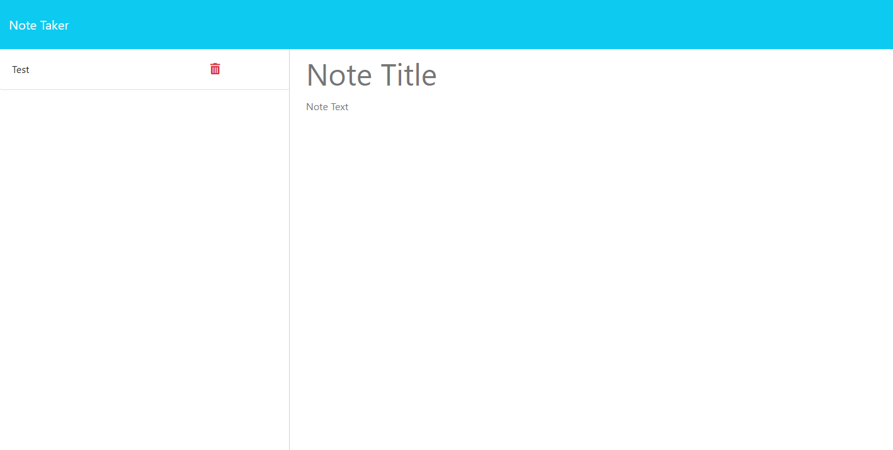

# Express-Note-Taker

## Table of Contents

- [Description](#description)
- [Installation](#installation)
- [Contributing](#contributing)
- [Usage](#usage)
- [Tests](#tests)
- [Questions](#questions)
- [Links](#links)
- [Screenshot](#screenshot)

## Description

This is a web app to take notes.

## Installation

Clone the code to an empty file from the GitHub page, in terminal run the command "npm i". Be sure to have Node.js installed on your machine.

## Contributing

Maguire Wilson
Xandromus, for starter code - github https://github.com/Xandromus

## Usage

In terminal run the command "node server.js" then go to http://localhost:3001/ on your web browser and start taking notes

## Questions

Additional questions?
You can find me [HERE](https://github.com/MacroWil) on GitHub.
Or, you can email me at macrow.co@gmail.com.

## Links

https://express-noter-6f981a2a998e.herokuapp.com/

## Screenshot

